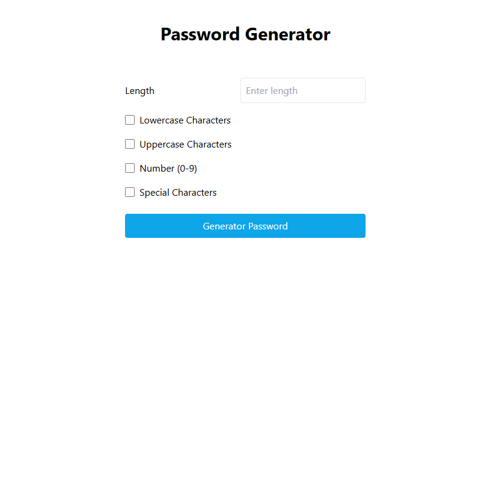

# Password Generator

## Features
- Generate random passwords
- Customize password length
- Include lowercase characters
- Include uppercase characters
- Include numbers
- Include special characters
- Beautiful UI with Tailwind CSS

## Preview

<!-- Add your screenshot image path above -->

## Technologies Used
- HTML
- JavaScript
- Tailwind CSS

## How to Use
1. Open the index.html file
2. Select desired password options
3. Click "Generate Password" button
4. Copy your generated password

## Installation
```bash
# Clone the repository
git clone https://github.com/C0deXG/Advance-password-Generator.git

# Navigate to the project directory
cd password-generator
```
